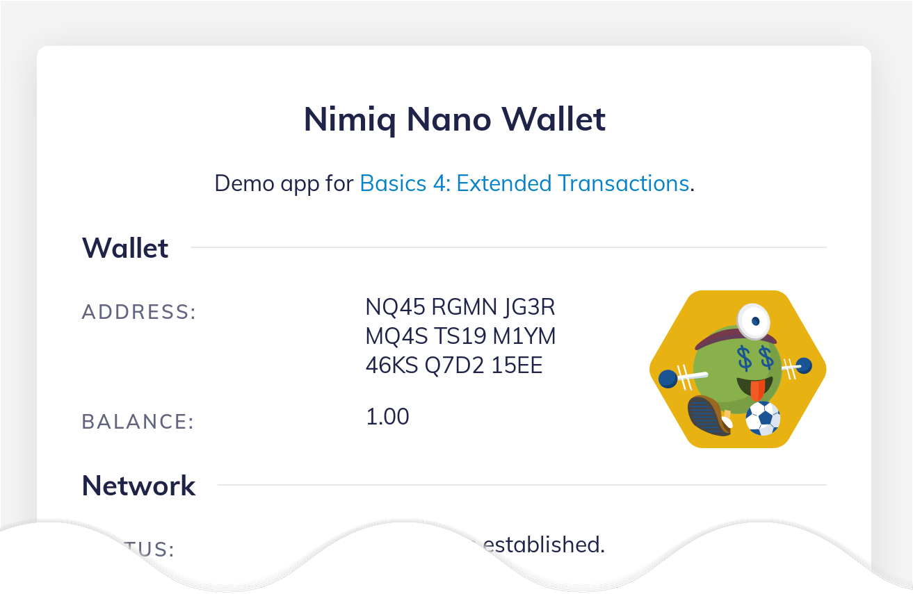

# Basics 5: Nimiq Iqons

_TL;DR? [Run the demo](playground.html#basics-5-iqons-demo.html)._

Building on the tutorial [Basics 4: Extended Transactions](basics-4-extended-tx),
we can add one of Nimiq's unique features: [Iqons](https://github.com/nimiq/iqons).

Iqons help user to identify addresses,
for example helping them to make sure that they entered the correct recipient.
Here is an example: the address `NQ45 RGMN JG3R MQ4S TS19 M1YM 46KS Q7D2 15EE` corresponds to the Iqon in the screenshot.



First, let's load the Nimiq Iqons lib at the top of our script:

```javascript
import Iqons from "https://unpkg.com/@nimiq/iqons@1.2.0/dist/iqons.bundle.min.js";
```

For this to work we can take advantage of the `module` type definition by changing the `<script>` tag to:

```html
<script type="module">
```

## An Iqon for our own wallet address

To use the lib, we get the user-friendly address of our wallet and create an Iqon for it.
It's three new lines of code in `start()`:

```javascript
...
// Code from Basics 4: Load or generate a wallet.
const stored = localStorage.getItem('wallet');
const wallet = stored ? Nimiq.Wallet.loadPlain(JSON.parse(stored)) : await Nimiq.Wallet.generate();
localStorage.setItem('wallet', JSON.stringify(Array.from(wallet.exportPlain())));

// New code:
// Get and show the user-friendly address of our wallet
const address = wallet.address.toUserFriendlyAddress();
$('address').innerText = address;
// Create an Iqon for it and render it into a container with ID "iqon"
await Iqons.render(address, $('iqon'));
...
```

For this to work, let's place a container with the ID "iqon" into the HTML:

```html
...
<div class="nq-card-body">
    <h2><span>Wallet</span></h2>
    <div id="iqon"></div> <!-- just this line -->
    <p>
        <span class="nq-label">Address: </span>
        <span id="address">loading&hellip;</span></p>
    <p>
...
```

Now, when reloading the web-app, an Iqon will appear.
Of course a different one for you as it depends on your wallet's address.

## Iqons for sending transactions

In the "Send Transaction" section of our app, let's add a part that will visualize the transaction by
showing an Iqon for the sender, the amount being transferred and another Iqon for the receiver.

First step, some HTML markup:

```HTML
<div id="transaction">
    ...
    <p>
        <label class="nq-label" for="tx_message">Message</label>
        <input type="text" id="tx_message" placeholder="A message for the recipient (optional)">
    </p>
    <!-- the section to visualize the transactions with Iqons: -->
    <p id="tx_overview">
        <span id="tx_overview_sender"></span>
        <span> ⇢ </span>
        <span id="tx_overview_amount"></span>
        <span> ⇢ </span>
        <span id="tx_overview_recipient"></span>
    </p>
    <!-- end of new section -->
    <button id="tx_send" class="nq-button" disabled>Send Transaction</button>
</div>
```

A new function to generate the "transaction overview".
It extracts the data entered into the transaction form and renders it into the HTML section we added before.
The function will check the entered values
and if everything works without an error, we'll show the overview:

```javascript
async function transactionOverview() {
    let ready = false;
    try {
        // Test if recipient address is valid by converting it forth and back
        // to a user-friendly address and finally create an Iqon
        const recipientAddress = Nimiq.Address
            .fromUserFriendlyAddress($('tx_recipient').value.trim())
            .toUserFriendlyAddress();
        await Iqons.render(recipientAddress, $('tx_overview_recipient'));

        // Render our own wallet's address as Iqon
        await Iqons.render(nimiq.wallet.address.toUserFriendlyAddress(), $('tx_overview_sender'));

        // Show the amount to be sent
        const amount = parseFloat($('tx_amount').value || '0');
        $('tx_overview_amount').innerText = `${amount} NIM`;

        // If everything worked until here and a positive amount is set
        // we're ready to show the overview
        ready = amount > 0;
    } catch (error) { }

    // Show overview and and enable the send button if ready
    $('transaction').classList.toggle('ready', ready);
    $('tx_send').disabled = !ready;
}
```

Next step, call the `transactionOverview()` function each time the user enters something into
the amount or recipient box of the transaction form by adding two `keyup` listeners at the end of `start()`:

```js
$('tx_amount').addEventListener('keyup', transactionOverview);
$('tx_recipient').addEventListener('keyup', transactionOverview);
```

Finally some CSS to
a) show the transaction form only once consensus has been established and
b) show the overview if the entered transactions data is valid.
By folding and unfolding the sections using a little animation:

```css
#transaction {
    max-height: 0;
    overflow: hidden;
    transition: max-height .3s;
}

.consensus-established #transaction {
    max-height: 63rem;
}

#tx_overview {
    /* ... */
    max-height: 0;
    overflow: hidden;
    transition: max-height 1s;
}

#transaction.ready #tx_overview {
    max-height: 21rem;
}
```

Add the `consensus-established` class to show the transactions form:

```js
function onConsensusEstablished() {
    status('Consensus established.');
    $('height').innerText = nimiq.blockchain.height;
    document.body.classList.add('consensus-established'); // <-- this line

    nimiq.blockchain.on('head-changed', onHeadChanged);
    updateBalance();
}
```

This is the end of the Basics Tutorial Series!

As a Nimiq Basics Code Ninja, you can now proudly wear the golden belt of honor.
But you don't have to. ;)

---

Find more help and documentation in the [Nimiq Developer Center](https://nimiq.com/developers/).
Get in touch at [sven@nimiq.com](mailto:sven@nimiq.com) to share your ideas and feedback!
