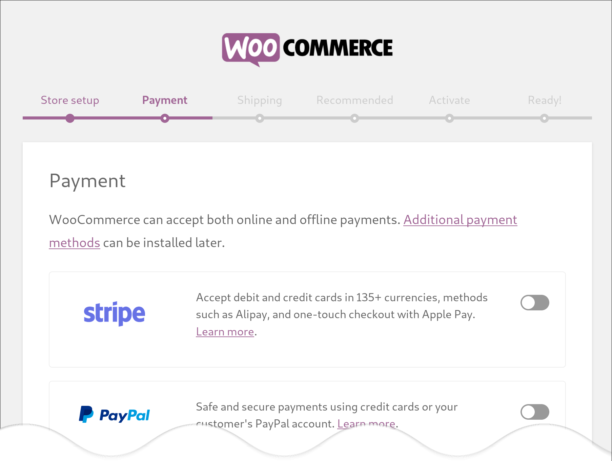

# Nimiq Payment Plugin for WordPress WooCommerce

WooCommerce is one of the most common online shop systems used on the Web.
Integrated into WordPress, it allows you to quickly set up your own online shop.

_TL;DR? Check out the [Nimiq Shop](https://shop.nimiq.com/) to see the plugin in action._

The installation will be three steps:

1) Preparing the server and setting up WordPress
1) Adding the WooCommerce plugin and configuring it
1) Finally, adding the Nimiq plugin plus a quick setup

## WordPress

If you are using a managed service,
e.g. [DigitalOcean's one-click-apps](https://www.digitalocean.com/products/one-click-apps/),
the management interface will provide a one-click installation of WordPress.
If not, download WordPress [here](https://wordpress.org/download/)
and follow [these steps](https://codex.wordpress.org/Installing_WordPress#Detailed_Instructions) to install it.

Otherwise, if you're using a VPS (virtual private server), or your own machine,
we recommend installing WordPress via Docker-compose (right below),
or you can install all requirements [manually](#manual-installation).

### Docker (recommended)

As prerequisite, you need to install Docker and Docker Compose.
To test whether Docker and Docker Compose are installed already run `which docker` and `which docker-compose`,
if both commands yield a path, e.g. `/usr/local/bin/docker-compose` then they are setup correctly and you can skip this step.
Otherwise, please refer to [this page](https://docs.docker.com/compose/install/)
for detailed instructions for all operating systems.

**For Linux users**: Make sure to follow the
[post-installation steps](https://docs.docker.com/install/linux/linux-postinstall/).
They will also explain how to make Docker start with the system.
Otherwise, before using Docker or Docker Compose, you'll need to start Docker with `sudo systemctl start docker`.
As an extra, you can also add command-line completion for Docker Compose following [this guide](https://docs.docker.com/compose/completion/).

To get a basic version of WordPress in a Docker container for local testing use
[Docker's official guide for WordPress]( https://docs.docker.com/compose/wordpress/).
It's a "one-time installation", i.e. it won't keep your settings and plugins.

For the online shop, we're going to setup Docker to store
all configurations, user uploads, the database content as well as all plugins outside the Docker container.
This way we can 1) easily backup all relevant data and 2) keep all configurations even if we restart the service.

1) **Storage location**: Create a folder in you home directory to store the custom WordPress data:

   ```bash
   mkdir -p ~/wordpress/data ~/wordpress/database
   ```

2) **Docker compose**: Create a `docker-compose.yaml` file in `~/wordpress`
   (or [download it](resources/docker-compose.yaml)) with the following content.
   This will instruct Docker to setup a MySQL database and install WordPress
   but store all the data in the folder created before.
   The file below runs your shop on port `8080` which is good for testing.
   Once every is set up, change `8080:80` to `80:80`.

   ```yaml
   version: '3.6'

   services:
       db:
           image: mysql:5.7
           volumes:
               - ~/wordpress/database:/var/lib/mysql
           restart: always
           environment:
               MYSQL_ROOT_PASSWORD: mypassword
               MYSQL_DATABASE: wordpress
               MYSQL_USER: wordpress
               MYSQL_PASSWORD: wordpress

       wordpress:
           image: wordpress:latest
           depends_on:
               - db
           ports:
               - 8080:80 # change to 80:80 when the shop is ready to go live
           restart: always
           environment:
               WORDPRESS_DB_HOST: db:3306
               WORDPRESS_DB_USER: wordpress
               WORDPRESS_DB_PASSWORD: wordpress
           volumes:
               - ~/wordpress/data:/var/www/html/wp-content
   ```

3) **Start and stop**: Open a terminal, go to `~/wordpress` and run your docker with `up` and stop it with `down`.

   ```bash
   docker-compose up     # start docker with logs printed to stdout
   docker-compose up -d  # start detached (daemon) to run in the background
   docker-compose down   # shutdown detached docker instances
   ```

4) **WordPress installation**: Going to [localhost:8080](http://localhost:8080)
   (replace `localhost` with the IP of your VPS/server), your newly installed WordPress
   will greet you with an installation wizard, go through it to set up a user account and other details.

To clean-up and reset your installation use:

```bash
docker container prune       # delete docker instances
docker volume prune          # delete volumes mounted to docker instances
docker volume rm wp_db_data  # specifically clear the DB data used with Wordpress
```

### Manual installation

In general, two steps are required:

1) Install LAMP on Linux or WAMP/XAMPP/MAMP on Windows and Mac
2) [Download](https://wordpress.org/download/) and install Wordpress

For more details, please refer to these two in-depth explanations
[for Linux](https://www.digitalocean.com/community/tutorials/how-to-install-wordpress-with-lamp-on-ubuntu-18-04)
and
[Windows](https://www.wpbeginner.com/wp-tutorials/how-to-install-wordpress-on-your-windows-computer-using-wamp/).

## WooCommerce

Log into the the admin panel of your WordPress installation at `/wp-admin/`,
select _Plugins_ ⇒ _Add New_ ⇒ search for "woocommerce" ⇒ and hit _Install Now_.


**Note**: If a popup asking for FTP credentials shows up when clicking _Install Now_ make sure the `~/wordpress` folder
and all its subfolders are writable for the `docker` group with `chmod -R g+w ~/wordpress`.

After the installation is completed, click _Activate_ and follow the setup process.
FYI, WooCommerce will suggest to install and sign-up for a lot of other third-party plugins.
Take your time and decide wisely. :)


During the process, disable able all other payment options.
A future version of the Nimiq Payment Plugin will work in combination with other payment methods.



## Nimiq Plugin

Download the latest Nimiq Payment Plugin as ZIP file [here](https://github.com/nimiq/woocommerce-gateway-nimiq/releases).
Go to _Plugins_ ⇒ _Add New_ ⇒ click _Upload Plugin_, upload the ZIP file you just downloaded ⇒
and click _Activate_ after the installation.

You'll now find the _WooCommerce Nimiq Gateway_ in the list of installed plugins.
Click _Configure_.
You need to setup your Nimiq Address to receive transactions and you might want to adjust other settings according to your needs.

Next, go to _WooCommerce_ ⇒ _Settings_ ⇒ _General_ and select at the bottom of the page _Currency_ "Nimiq (NIM)".

**Notes**: For now, the Nimiq Payment Plugin is available for the Nimiq Testnet only.
The Mainnet version is expected to be ready by the end of Q1 2019 and
will be available via Wordpress' built-in marketplace.

**Disclaimer**: please check the legal and tax requirements of your country before starting to sell with your shop.
