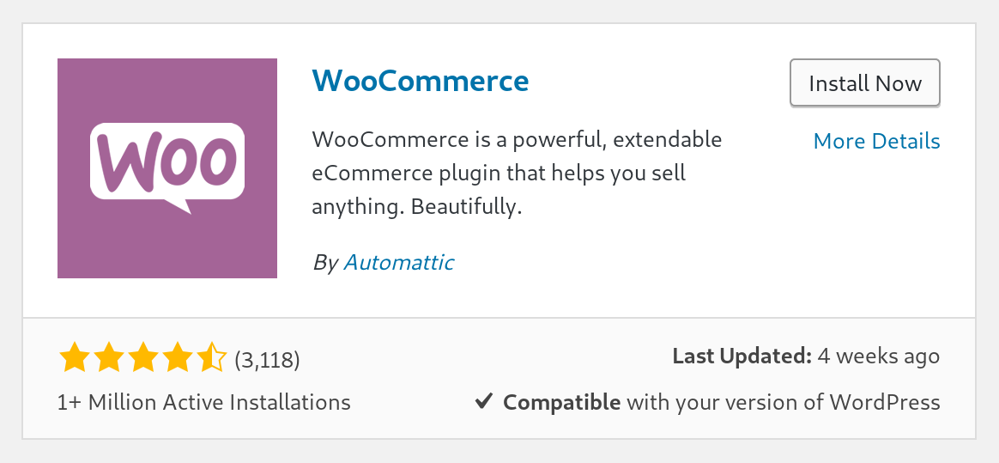

# Nimiq WordPress WooCommerce Plugin: Installation

WooCommerce is one of the most common online shop systems used on the Web.
Integrated into WordPress, it allows you to quickly set up your own online shop.

_TL;DR? Check out the [Nimiq Shop](https://shop.nimiq.com/) to see the plugin in action._

## WordPress

If you are using a managed service,
e.g. [DigitalOcean's one-click-apps](https://www.digitalocean.com/products/one-click-apps/),
the management interface will provide a one-click installation of WordPress.

Otherwise, if you're using a VPS (virtual private server), a web hosting service, or your own machine,
we suggest two ways of installing WordPress:
Via Docker-compose (the recommended way) or
by manually installing all requirements.

### Docker (recommended)

As prerequisite, you need to install Docker and Docker Compose.
Please refer to [this page](https://docs.docker.com/compose/install/) for detailed instructions for all operating systems.
As an extra, you can add command-line completion for Docker following [this guide](https://docs.docker.com/compose/completion/).

To get a basic version of WordPress in a Docker container for local testing use
[Docker's official guide for WordPress]( https://docs.docker.com/compose/wordpress/).

To setup an online shop online, we need an installation that keeps plugins and other configurations despite being restarted.

1) **Store location**: Create a folder in you home directory to store the custom WordPress data with

   ```bash
   mkdir -p ~/wordpress/data ~/wordpress/database
   ```

1) **Docker compose**: Create a `docker-compose.yaml` file in `~/wordpress`
   (or [download it](resources/docker-compose.yaml)) with the following content.
   This will instruct Docker to setup a MySQL database and install WordPress
   but store all the data in the folder we just.
   The file below runs your shop on port `8080` which is good for testing.
   Once every is set up, change `8080:80` to `80:80`.

   ```yaml
   version: '3.6'

    services:
        db:
            image: mysql:5.7
            volumes:
                - ~/wordpress/database:/var/lib/mysql
            restart: always
            environment:
                MYSQL_ROOT_PASSWORD: mypassword
                MYSQL_DATABASE: wordpress
                MYSQL_USER: wordpress
                MYSQL_PASSWORD: wordpress

        wordpress:
            image: wordpress:latest
            depends_on:
                - db
            ports:
                - 8080:80 # change to 80:80 when the shop is ready to go live
            restart: always
            environment:
                WORDPRESS_DB_HOST: db:3306
                WORDPRESS_DB_USER: wordpress
                WORDPRESS_DB_PASSWORD: wordpress
            volumes:
                - ~/wordpress/data:/var/www/html/wp-content
   ```

1) **Start and stop**: Open a terminal, go to `~/wordpress` and run your docker with `up` and stop it with `down`.

   ```bash
   docker-compose up     # start docker with logs printed to stdout
   docker-compose up -d  # start detached (daemon) to run in the background
   docker-compose down   # shutdown docket instances
   ```

1) **WordPress installation**: Going to [localhost:8080](http://localhost:8080)
   (replace `localhost` with the IP of your VPS/server), your newly installed WordPress
   will greet you with an installation wizard, go through it to set up a user account and other details.

[done until here]
---

BUG/TODO:
Asks for "Connection Information" > something wrong with permissions on `.wordpress`

---
[continue here when bug is solved.]

Start and stop your WordPress container:


Clean-up and reset your installation:

```bash
docker container prune       # delete docker instances
docker volume prune          # delete volumes mounted to docker instances
docker volume rm wp_db_data  # specifically clear the DB data used with Wordpress
```

### Manual

In general, two steps are required:

1) Install LAMP on Linux or WAMP/XAMPP/MAMP on Windows and Mac
2) [Download](https://wordpress.org/download/) and install Wordpress

For more details, please refer to these two in-depth explanations
[for Linux](https://www.digitalocean.com/community/tutorials/how-to-install-wordpress-with-lamp-on-ubuntu-18-04)
and
[Windows](https://www.wpbeginner.com/wp-tutorials/how-to-install-wordpress-on-your-windows-computer-using-wamp/).

## WooCommerce

Log into the the admin panel of your WordPress installation at `/wp-admin/`,
select _Plugins_ > _Add New_ > search for "woocommerce" > and hit _install_.



---

Asks for "Connection Information" > add `.wordpress` to docker group (docker volume permissions)
From market place
activate
run or skip setup?
Instructions on how to click through the setup dialog
> ideally screenshots of

Disclaimer: check out the legal and tax requirements of your country before starting to sell with your shop.

compose down > plugin still there? >

docker prune

## Nimiq Plugin

Upload plugin
(future: Wordpress market place)

## Plugin Setup
